# 1.Introduction RTOS

Normal : Super loop  code start with setup()  then go to the loop to executes its tasks  sequentialy .

Using RTOS : Entry Point  is our main() then executes tasks in parallel [concurrent tasks].

* Task : set of instruction loaded in memory
* Thread : unit of CPU utilization with its own pc and stack , and can share ressource between other threads
* Process : instance of program

RTOS can handle only one process with many threads/tasks, in FreeRTOS task will refer to thread.

# **2.Task Scheduling**

**Scheduler:** The scheduler is the core component of an RTOS that decides which task should run at any given time based on their priorities and states.

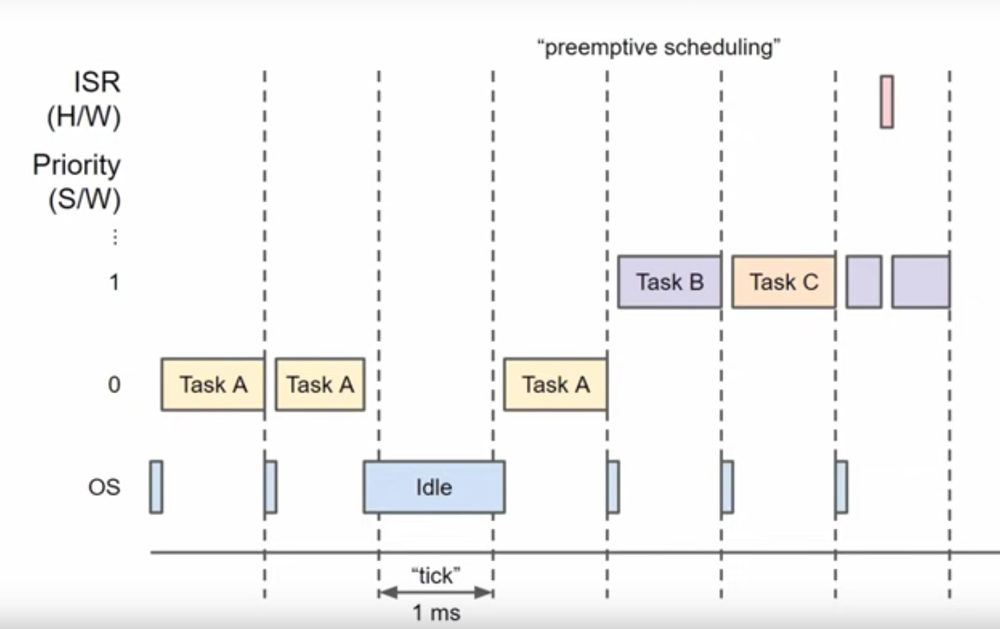

In SMP : a scheduler may choose to put some tasks on another core

TaskCreation > Ready  <> Running . can be blocked by API like v-delay putting it in blocked state waiting for event like time expire .

Task can be in  suspened state by using : vTaskSuspend() and to unblock it call vTaskResume() explicitly  . and that instead of using v-delay as an example.

Task handler : pointer to function/task to be executed

* On a single-core system, tasks do not run at the same time but share CPU time via time slicing.
* The scheduler ensures that each task gets a fair share of CPU time based on the tick rate.

## Scheduling Algorithms

1. **Preemptive Scheduling[Automatic switching]:** The scheduler can interrupt a running task if a higher priority task becomes ready.

   2.**Cooperative Scheduling[Manaul]:** The running task must yield control voluntarily to allow the scheduler to switch to another task. [when a task voluntarily yields control or becomes blocked]

* 
* **Task Yielding (e.g., `taskYIELD()`):** Explicitly relinquishes CPU control, allowing the scheduler to switch tasks immediately.

  **Task Blocking (e.g., `vTaskDelay()`):** Puts the task in a blocked state, allowing other tasks to run until the blocking condition is met.

## Time Slicing (Round-Robin Scheduling)

1. **Single Core Execution:**

   * On a single-core processor, only one task can run at any given moment. The scheduler switches between tasks at each tick interrupt, which occurs at a rate defined by `configTICK_RATE_HZ`.
2. **Tick Interrupts:**

   * The system tick interrupt periodically interrupts the currently running task. The frequency of these interrupts is set by `configTICK_RATE_HZ` in `FreeRTOSConfig.h`.
   * During each tick interrupt, the scheduler determines whether to switch to another task of the same priority.
3. **Context Switching:**

   * When the tick interrupt occurs, the scheduler may perform a context switch, saving the current task's state and restoring the state of the next task in the ready queue.
   * This process is repeated, ensuring that each task gets an equal share of the CPU time.
   * Switching :
   * Saves the state of the currently running task.
   * Restores the state of the next task in the queue.
   * Resumes execution of the new task.

On a multi-core system, tasks can run concurrently on different cores, allowing for true parallel execution.

* **Preemptive Multitasking:**
  * **Time Slice Expiration:** Can lead to automatic preemption and context switching. [regardless time]
  * **Priority-Based:** Higher-priority tasks can preempt lower-priority tasks automatically, regardless of time slices.
* **Cooperative Multitasking:**
  * **Manual Yielding:** Tasks must explicitly yield control.
  * **No Automatic Preemption:** Tasks will not be preempted unless they yield or block themselves.

    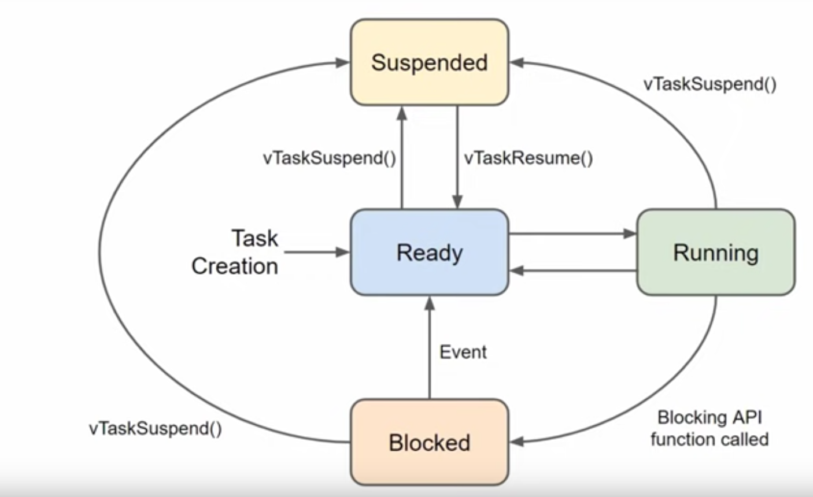

#### Tasks can be in several states:

* **Ready** : Tasks that are ready to execute and waiting for the scheduler to allocate CPU time to them. This includes tasks that have not completed their execution because their time slice expired or they were preempted.
* **Running** : The task currently executing on the CPU.
* **Blocked** : Tasks that are waiting for an event (such as acquiring a mutex, semaphore, or waiting for a message) and cannot proceed until that event occurs. Blocked tasks are not eligible for execution until they become unblocked.
* **Suspended** : Tasks that have been manually suspended and are not eligible for execution until they are resumed.
* **Task State Transition** : The FreeRTOS kernel manages the transition of the task’s state. While the task is blocked due to the delay, other ready tasks can continue to execute. The kernel keeps track of the remaining delay time and the task’s state.

# 3.Memory Management

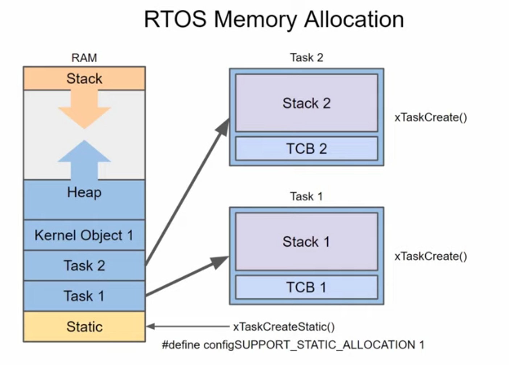

* **Task Control Block (TCB):** Holds task management information, allocated from the heap or static memory.
* **Task Stack:** Stores local variables and execution context, allocated from the heap or provided statically.
* **Dynamic Allocation:** Uses `xTaskCreate()` to allocate memory dynamically.
* **Static Allocation:** Uses `xTaskCreateStatic()` to allocate memory statically, requiring user-provided buffers for the TCB and stack.

  When Stack of task is full it will return error / make microcontroller to reset
* **Check Stack High Water Mark:**

  * Use the `uxTaskGetStackHighWaterMark()` function to determine the minimum amount of stack space remaining for a task. help in identifing tasks that are close to overflowing.  [that space from task stack space or ? ]

## Task Creation [Dynamic / Static]

### Dynamic Task Creation:

Dynamic allocation uses the `xTaskCreate()` function, which requires memory for the Task Control Block (TCB) and the task's stack. The FreeRTOS heap implementation handles this allocation, and you need to configure the heap memory size accordingly.

```
xTaskCreate(
    myTaskFunction,  // Task function
    "TaskName",      // Task name
    200,             // Increased stack size
    NULL,            // Task parameters
    1,               // Task priority
    NULL             // Task handle
);
```

### Static Task Creation:

**Memory Allocation:** Memory for both the TCB and stack must be provided by the user. No dynamic allocation occurs.

```
StaticTask_t xTaskBuffer;
StackType_t xStack[100];

xTaskCreateStatic(
    myTaskFunction,   // Task function
    "TaskName",       // Task name
    100,              // Stack size in words
    NULL,             // Task parameters
    1,                // Task priority
    xStack,           // Stack buffer
    &xTaskBuffer      // TCB buffer
);

```

## Inside Task memory allocation

* **Memory Allocation Functions:**

  * **`pvPortMalloc()`** and **`vPortFree()`** are FreeRTOS-specific functions used to allocate and free memory in a way that is compatible with the FreeRTOS heap management. They should be used instead of standard C functions (`malloc()` and `free()`) to ensure compatibility and proper memory management.
* **Error Handling:**

  * Always check if the memory allocation was successful. If `pvPortMalloc()` returns `NULL`, it indicates that the memory allocation failed.
* **Memory Management:**

  * Ensure that any dynamically allocated memory is properly freed using `vPortFree()` when it is no longer needed. This prevents memory leaks and ensures efficient memory usage.
* To know the remaining HeapMemory can be allocated : xPortGetFreeHeapSize()

# 4. Queue

In FreeRTOS, queues are used for inter-task communication. A queue allows you to send and receive data between tasks or between interrupts and tasks.

Advantage of using queue :

* No value overwrite
* As if we use global variable and Tasks changes its value by reference if task with high priority change in this value it will overwrite on the old value and the value itself can be undefined as if it was larger than the word it will take more instructions to write and at that time it can be interrupted by other high priority task.

#### Problem

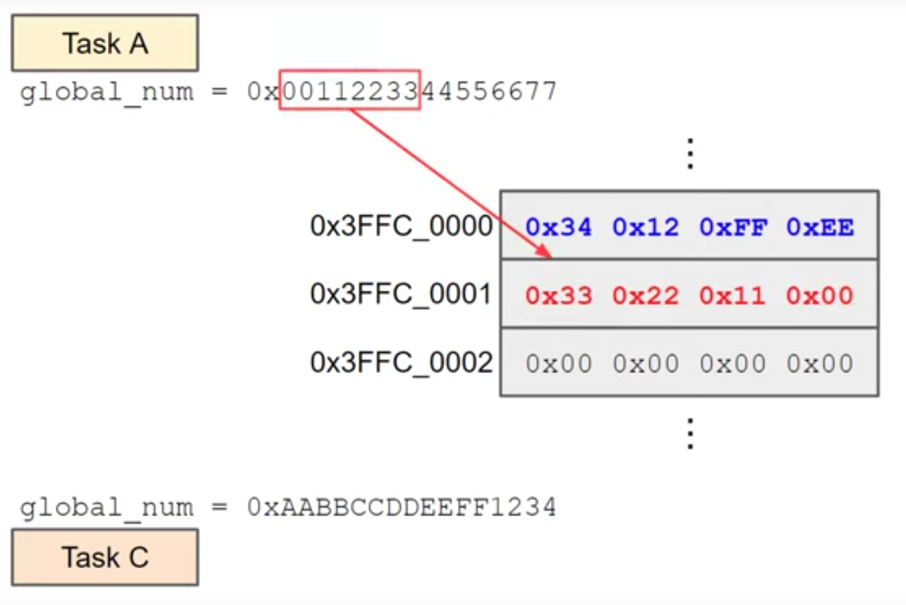

#### Solution : Creating a Queue:

```

    myQueue = xQueueCreate(10, sizeof(int));
    if (myQueue == NULL)
    {
        printf("Failed to create the queue\n");
        return -1;
    }
```

For Send / Recive : xQueueSend() / xQueueRecieve()

Each Task That send msg to queue will Be Read by The Reciever Task .

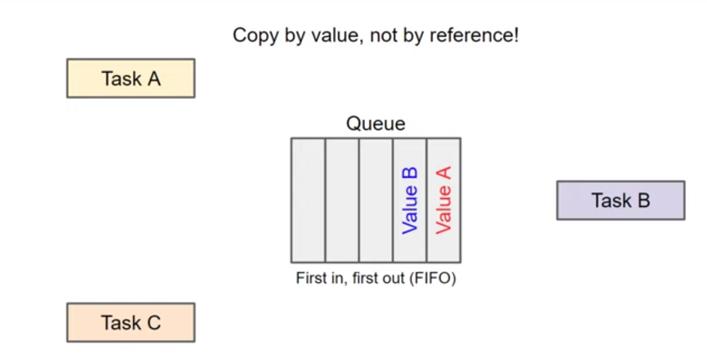

# 5.Mutex

**Usage** :We use Mutex if we want The variable we read/write to be avaliable the whole program all tasks can access it

#### **Problem** :Race Condition

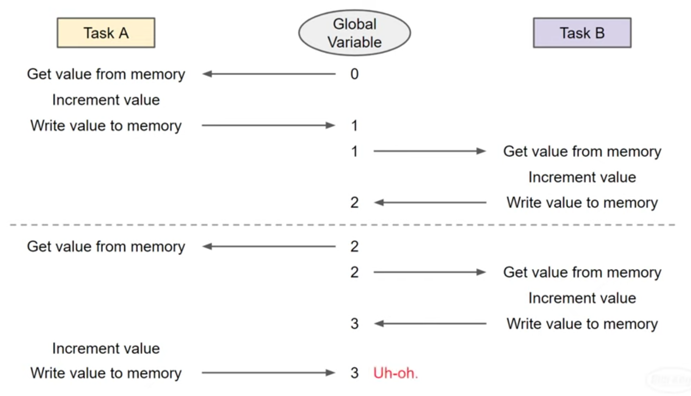

#### Solution

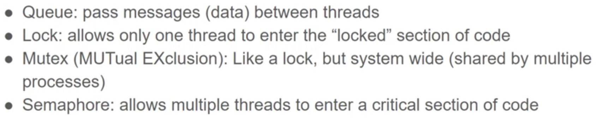

Critical Section Of code :area of code that access a shared resource.And This area should be executed by a task before another task. The concept of excluding other tasks from entering critical section is Mutual Exclusion

Lock = Mutex as we have only one WORKING Process in FreeRtos.

#### Explain

**Mutex** like a key , is a shared resource between tasks can be 0/1 . Checking & take mutex is an atomic operation which means it will be executed instructions & no other tasks can interrupt it.

**Counting Mutex at start = 1;**

When mutex is taken , other tasks cant get acess to the shared resource as they interrupt the task.

when other high priority task preempt the task that took mutex . it should go to Block/yield till event of mutex is avaliable again.

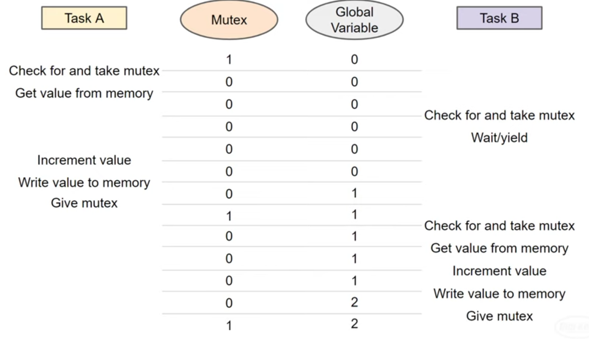

**Functions : Create , Take , Give**

```
SemaphoreHandle_t xMutex;
xMutex = xSemaphoreCreateMutex();
xSemaphoreTake(xMutex, portMAX_DELAY)
xSemaphoreGive(xMutex);

```

* **Priority inversion** occurs when a high-priority task is blocked by a low-priority task holding a shared resource, and an intermediate-priority task further delays the low-priority task.
* **Solutions** include priority inheritance and priority ceiling protocols to ensure high-priority tasks can access necessary resources in a timely manner.  it will be done automatically by FreeRTOS when using mutex

# 6.Semaphore

Semaphore as mutex but it contains a counter [keys] for number of threads that are allowed to enter the critical Section of code . But are often better used as a **signaling** mechanism to other threads

**Less Usage :**

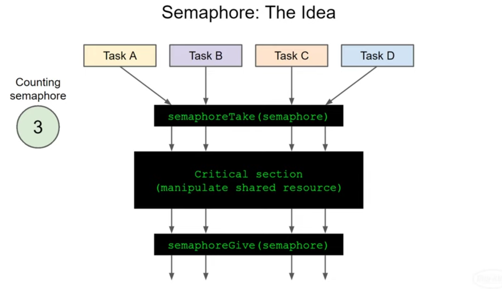

As working with shared resources we dont want tasks to overwrite on that rescource . am sure it has a use but not our case right now .

**Better Usage** : is to synchronize threads write/read

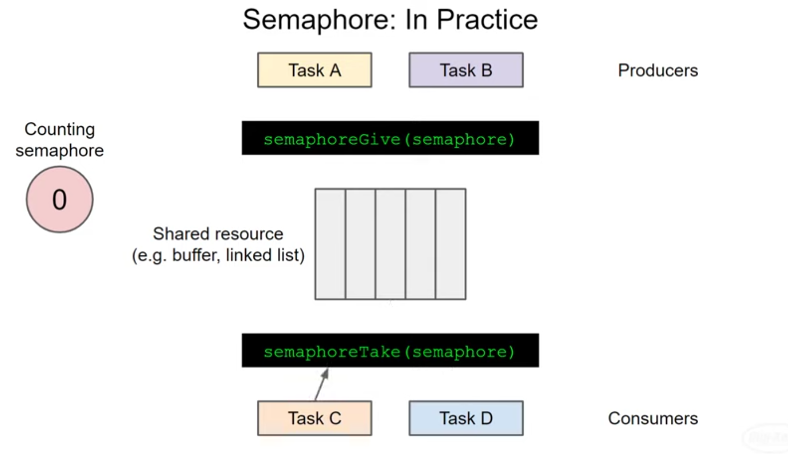

There is function to create semaphore with max numbers of keys and initialize the counter with 0;

```
xSemaphoreCreateCounting(max,0)
```

**BinarySemaphore is initialized with 0, max val of counter=1**

**Function : Take() only like while(1) waiting for the key.**

* We dont need to take it first like Mutex as if we used normal mutex the counter will be 1 and we  want to signal by giving mutex to tasks that want to take() . so it be like Task1:Take() > Task1:Give() > Task2:Take () . and that not good practice with normal mutex.

When task 1  Give semaphore , task 2 will be released from the blocking state that waits for the semaphore

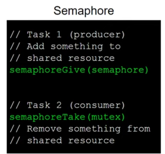

**If we want to design shared buffer so we will need :**

* Mutex for shared Buffer. For reading saftey between tasks that read.
* Semaphore for Space left in buffer.[Counting(max_buffer,max buffer) as it'll decrement each time new item inserted.
* Semaphore for items in buffer. [Counting(max_buffer,start value =0).While writing it gives a new key for new item.

  #### FLOW:


  * Writer : take(space) , take(mutex) , give(mutex) , give(item)
  * Reader : take(item),take(mutex),give(mutex),give(space)

# 7. Software Timer

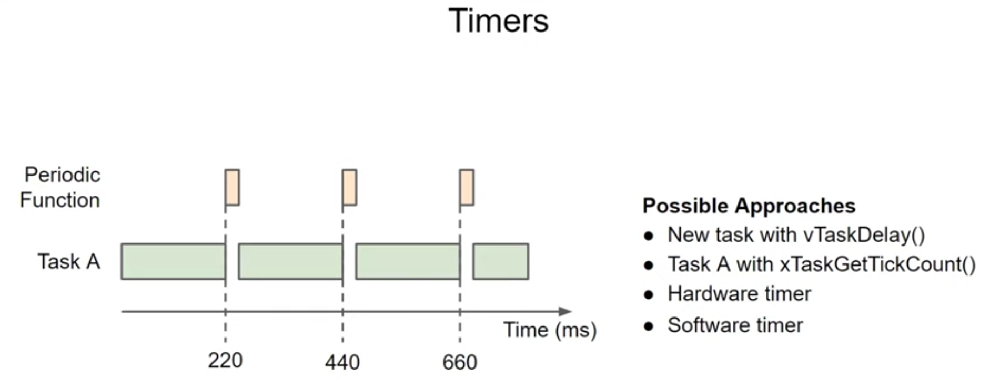

The Timer Service Task in FreeRTOS is a dedicated task responsible for managing software timers. It ensures that the callback functions associated with timers are executed at the correct time.

### **Timer Command Queue** :

* The commands to start `TImer1` and `Timer2` are enqueued. The Timer Service Task dequeues and processes these commands, starting the timers.
  BaseType_t xTimerStart( TimerHandle_t xTimer, TickType_t xTicksToWait );
* **`xTimer`** : The handle to the timer you want to start.
* **`xTicksToWait`** : The maximum amount of time the calling task should wait if the command cannot be immediately added to the timer command queue.
* If `xTicksToWait` is set to `0`, the function will not block if the command queue is full. Instead, it will return immediately with `pdFAIL` if there is no space available in the queue.

  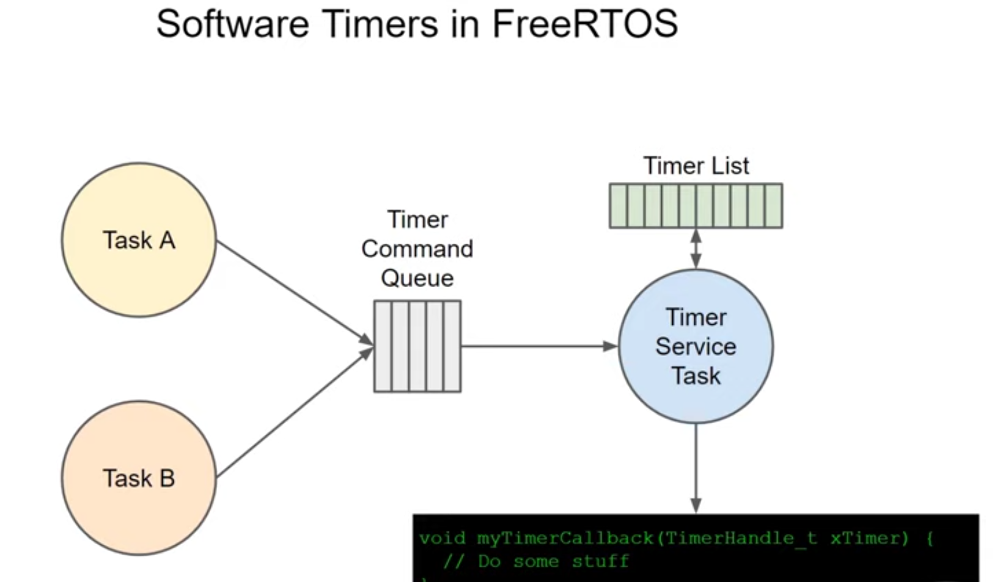

### Features of timer :

* **Non-blocking** : Timer callbacks are executed in the context of the Timer Service Task, so they don't block other tasks.
* **Multiple Timers** : You can create multiple software timers, each with different durations and callbacks.
* **Auto-reload and One-shot Timers** : Timers can be set to auto-reload, meaning they reset themselves after expiring, or they can be one-shot, meaning they run only once.

### Functions:

* **Timer Creation (`xTimerCreate`)** :
* The timer is created with a period of 1000 ms and is set to auto-reload (`pdTRUE`).
* The callback function `vExampleTimerCallback` will be called when the timer expires.
* **Timer Start (`xTimerStart`)** :
* The timer is started immediately.
* **Timer Callback (`vExampleTimerCallback`)** :
* This function is called by the Timer Service Task when the timer expires.

# 8. Hardware Interrupts

**ISR Context** : ISRs should execute quickly to avoid blocking the system. They often disable certain interrupts or use critical sections to prevent concurrent access issues. When ISR is called so other tasks work will stop

**ISR Functions** : ISRs are defined according to the specific microcontroller’s API. They should be as short and efficient as possible.

**Using Semaphores/Flags** : ISRs should not perform lengthy operations or blocking functions. Instead, they can signal tasks using mechanisms like semaphores or flags.

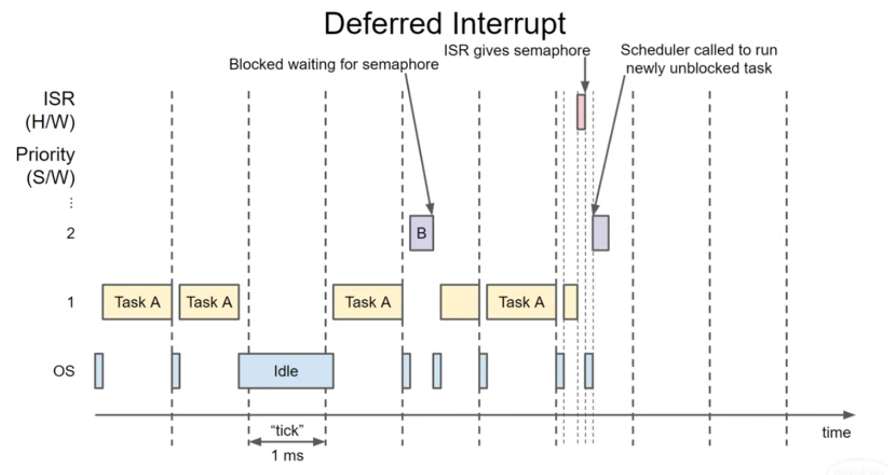

# 9. DeadLock & Starvation

### Starvation:

 **Definition** : Starvation happens when a task is continually overlooked and does not get the CPU time or resources it needs to execute, often because higher-priority tasks keep taking precedence.
 **Mitigation** :

* Ensure fair scheduling so tasks of the same priority get CPU time.
* Use priority inheritance to prevent lower-priority tasks from holding up higher-priority ones.
* Design tasks to be cooperative and release resources quickly.
* Use watchdog timers to reset the system if a task is starved for too long.

### Deadlock:

 **Definition** : Deadlock is when tasks wait indefinitely for resources held by each other, causing a standstill.
 **Mitigation** :

* Avoid circular dependencies.
* Implement timeouts.
* Use resource hierarchies.
* Employ priority inheritance.

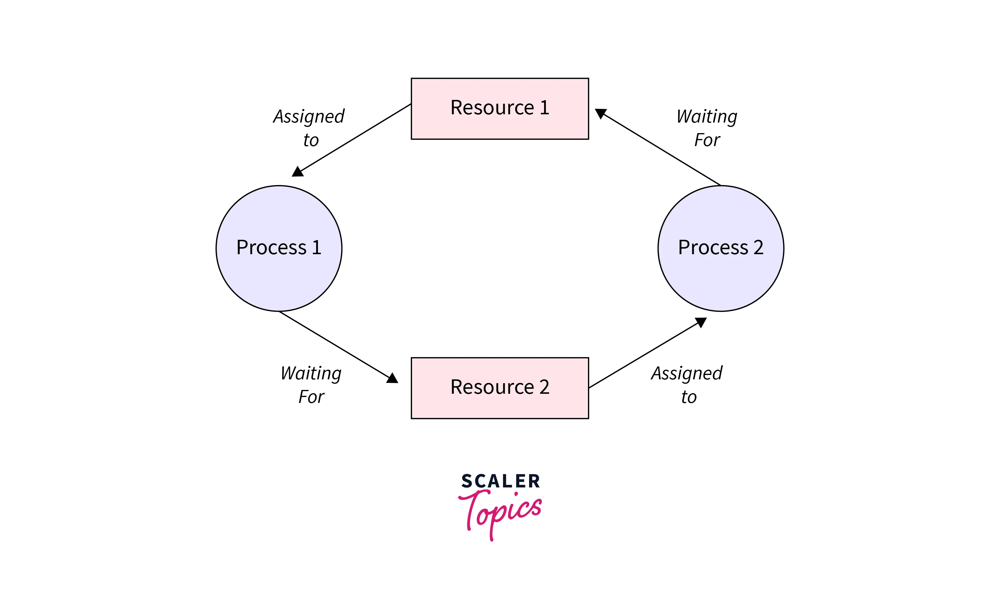

# 10. Priority inversion

### **Bounded Priority Inversion**

 **Definition** : Bounded priority inversion happens when the duration of the inversion is limited and predictable due to mechanisms like priority inheritance.

 **Example** :

1. **Task L** (low priority) acquires a mutex.
2. **Task H** (high priority) needs the mutex and gets blocked.
3. **Solution** :With  **priority inheritance** , Task L temporarily inherits Task H's priority, allowing it to complete its critical section quickly and release the mutex. [priority inheritance done automatic by FreeRTOS]
4. Task H then acquires the mutex and proceeds, ensuring the inversion duration is bounded.


### Unbounded Priority Inversion

 **Definition** : Unbounded priority inversion occurs when there is no limit to how long the high-priority task can be blocked, potentially due to the lack of priority inheritance or other mechanisms to handle priority inversion.

 **Example** :

1. Task L acquires a mutex.
2. Task H needs the mutex and is blocked.
3. Task M runs and preempts Task L, continuously taking CPU time.
4. Without priority inheritance, Task L remains at its low priority, unable to finish and release the mutex.
5. Task H remains blocked indefinitely, leading to unbounded priority inversion.

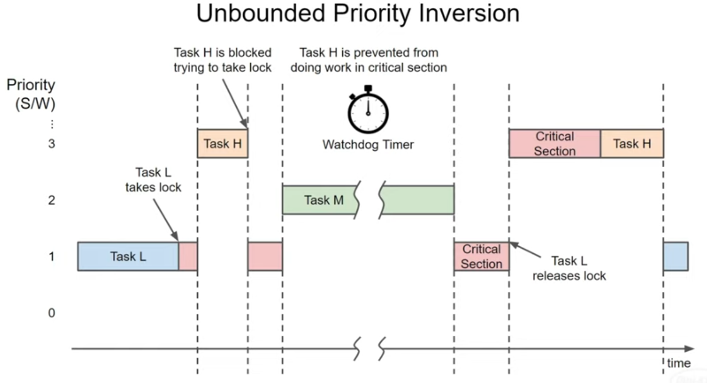

#### Solution

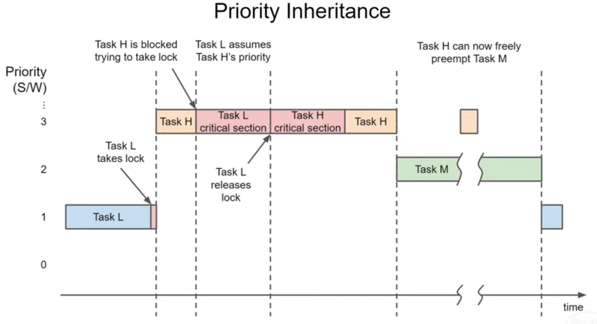

#### Other solution

The `portENTER_CRITICAL()` macro is used in FreeRTOS (and similar real-time operating systems) to manage critical sections of code, specifically for preventing interruptions or preemption that could lead to inconsistent or corrupted data.

```
portENTER_CRITICAL();
// Critical section code here
portEXIT_CRITICAL();

```

# 11. Multicore System

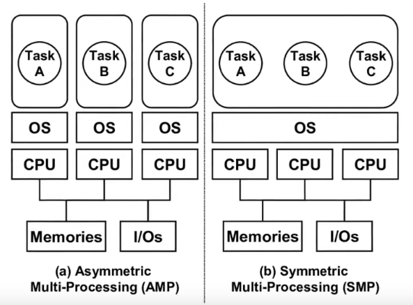
